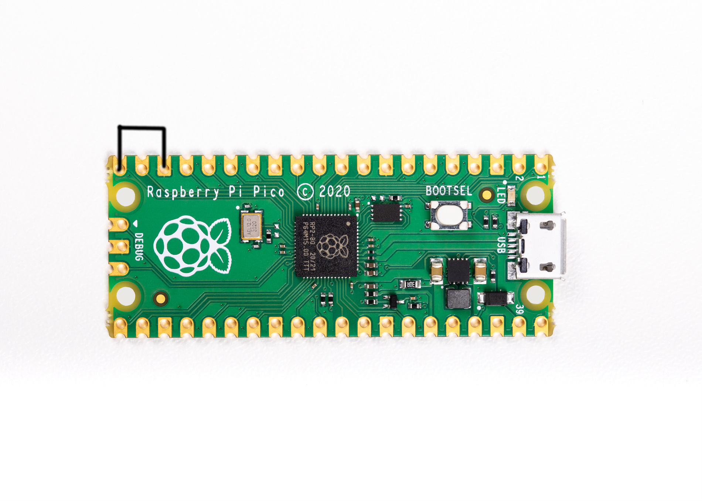

### Pico W Web Service
The Pico W AP defaults to ip address `192.168.4.1`.  You should be able to find the webservice at `http://192.168.4.1:80`  

The following endpoints are available on the webservice:
```
/
/new
/ducky
/edit/<filename>
/write/<filename>
/run/<filename>
```

API endpoints
```
/api/run/<filenumber>
```


### Setup mode

To edit the payload, enter setup mode by connecting the pin 1 (`GP0`) to pin 3 (`GND`), this will stop the pico-ducky from injecting the payload in your own machine.
The easiest way to do so is by using a jumper wire between those pins as seen bellow.


### USB enable/disable mode

If you need the pico-ducky to not show up as a USB mass storage device for stealth, follow these instructions.  
- Enter setup mode.    
- Copy your payload script to the pico-ducky.  
- Disconnect the pico from your host PC.
- Connect a jumper wire between pin 18 (`GND`) and pin 20 (`GPIO15`).  
This will prevent the pico-ducky from showing up as a USB drive when plugged into the target computer.  
- Remove the jumper and reconnect to your PC to reprogram.  

Pico: The default mode is USB mass storage enabled.   
Pico W: The default mode is USB mass storage **disabled**  



### Multiple payloads

Multiple payloads can be stored on the Pico and Pico W.  
To select a payload, ground one of these pins:
- GP4 - payload.dd
- GP5 - payload2.dd
- GP10 - payload3.dd
- GP11 - payload4.dd


## Useful links and resources

### How to recover your Pico if it becomes corrupted or doesn't boot.

[Reset Instructions](RESET.md)

### Installation Tool

[raspberrydeveloper](https://github.com/raspberrydeveloper) Created a tool to convert a blank RPi Pico to a ducky.  
You can find the tool [here](https://github.com/raspberrydeveloper/pyducky)

### Docs

[CircuitPython](https://circuitpython.readthedocs.io/en/6.3.x/README.html)

[CircuitPython HID](https://learn.adafruit.com/circuitpython-essentials/circuitpython-hid-keyboard-and-mouse)

[Ducky Script](https://github.com/hak5darren/USB-Rubber-Ducky/wiki/Duckyscript)

### Video tutorials

[pico-ducky tutorial by **NetworkChuck**](https://www.youtube.com/watch?v=e_f9p-_JWZw)

[USB Rubber Ducky playlist by **Hak5**](https://www.youtube.com/playlist?list=PLW5y1tjAOzI0YaJslcjcI4zKI366tMBYk)

[CircuitPython tutorial on the Raspberry Pi Pico by **DroneBot Workshop**](https://www.youtube.com/watch?v=07vG-_CcDG0)
