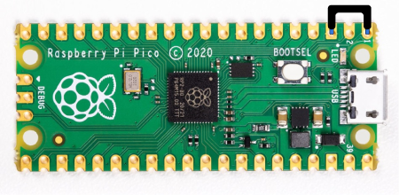

# Raspberry Pico Rubber ducky 


  Original Repository-Author <a href="https://github.com/dbisu/pico-ducky">dbisu</a> <br/> (https://github.com/dbisu/pico-ducky) <br/>
  <strong>Make a cheap but powerful USB Rubber Ducky with a Raspberry Pi Pico</strong>


## Install

Install and have your USB Rubber Ducky working in less than 5 minutes.

1. Clone the repo to get a local copy of the files. `git clone https://github.com/dbisu/pico-ducky.git`

2. Download [CircuitPython for the Raspberry Pi Pico](https://circuitpython.org/board/raspberry_pi_pico/). *Updated to 8.0.0  
   Download [CircuitPython for the Raspberry Pi Pico W](https://circuitpython.org/board/raspberry_pi_pico_w/). *Updated to 8.0.0

3. Plug the device into a USB port while holding the boot button. It will show up as a removable media device named `RPI-RP2`.

4. Copy the downloaded `.uf2` file to the root of the Pico (`RPI-RP2`). The device will reboot and after a second or so, it will reconnect as `CIRCUITPY`.

5. Download `adafruit-circuitpython-bundle-8.x-mpy-YYYYMMDD.zip` [here](https://github.com/adafruit/Adafruit_CircuitPython_Bundle/releases/latest) and extract it outside the device.

6. Navigate to `lib` in the recently extracted folder and copy `adafruit_hid` to the `lib` folder on your Raspberry Pi Pico.

7. Copy `adafruit_debouncer.mpy` and `adafruit_ticks.mpy` to the `lib` folder on your Raspberry Pi Pico.

8. Copy `asyncio` to the `lib` folder on your Pico.

9. Copy `adafruit_wsgi` to the `lib` folder on your Pico.

10. Copy `boot.py` from your clone to the root of your Pico.

11. Copy `duckyinpython.py`, `code.py`, `webapp.py`, `wsgiserver.py` to the root folder of the Pico.

12. *For Pico W Only* Create the file `secrets.py` in the root of the Pico W. This contains the AP name and password to be created by the Pico W.  
`secrets = { 'ssid' : "BadAPName", 'password' : "badpassword" }`

13. Find a script [here](https://github.com/hak5/usbrubberducky-payloads) or [create your own one using Ducky Script](https://docs.hak5.org/hak5-usb-rubber-ducky/ducky-script-basics/hello-world) and save it as `payload.dd` in the Pico. Currently, pico-ducky only supports DuckScript 1.0, not 3.0.

14. Be careful, if your device isn't in [setup mode](#setup-mode), the device will reboot and after half a second, the script will run.

15. **Please note:** by default Pico W will not show as a USB drive

### Pico W Web Service
The Pico W AP defaults to ip address `192.168.4.1`.  You should be able to find the webservice at `http://192.168.4.1:80`  

The following endpoints are available on the webservice:
```
/
/new
/ducky
/edit/<filename>
/write/<filename>
/run/<filename>
```

API endpoints
```
/api/run/<filenumber>
```

### Setup mode

To edit the payload, enter setup mode by connecting the pin 1 (`GP0`) to pin 3 (`GND`), this will stop the pico-ducky from injecting the payload in your own machine.
The easiest way to do so is by using a jumper wire between those pins as seen bellow.



### USB enable/disable mode

If you need the pico-ducky to not show up as a USB mass storage device for stealth, follow these instructions.  
- Enter setup mode.    
- Copy your payload script to the pico-ducky.  
- Disconnect the pico from your host PC.
- Connect a jumper wire between pin 18 (`GND`) and pin 20 (`GPIO15`).  
This will prevent the pico-ducky from showing up as a USB drive when plugged into the target computer.  
- Remove the jumper and reconnect to your PC to reprogram.  

Pico: The default mode is USB mass storage enabled.   
Pico W: The default mode is USB mass storage **disabled**  


### Multiple payloads

Multiple payloads can be stored on the Pico and Pico W.  
To select a payload, ground one of these pins:
- GP4 - payload.dd
- GP5 - payload2.dd
- GP10 - payload3.dd
- GP11 - payload4.dd


## Useful links and resources

### How to recover your Pico if it becomes corrupted or doesn't boot.

[Reset Instructions](RESET.md)

### Installation Tool

[raspberrydeveloper](https://github.com/raspberrydeveloper) Created a tool to convert a blank RPi Pico to a ducky.  
You can find the tool [here](https://github.com/raspberrydeveloper/pyducky)

### Docs

[CircuitPython](https://circuitpython.readthedocs.io/en/6.3.x/README.html)

[CircuitPython HID](https://learn.adafruit.com/circuitpython-essentials/circuitpython-hid-keyboard-and-mouse)

[Ducky Script](https://github.com/hak5darren/USB-Rubber-Ducky/wiki/Duckyscript)

### Video tutorials

[pico-ducky tutorial by **NetworkChuck**](https://www.youtube.com/watch?v=e_f9p-_JWZw)

[USB Rubber Ducky playlist by **Hak5**](https://www.youtube.com/playlist?list=PLW5y1tjAOzI0YaJslcjcI4zKI366tMBYk)

[CircuitPython tutorial on the Raspberry Pi Pico by **DroneBot Workshop**](https://www.youtube.com/watch?v=07vG-_CcDG0)
